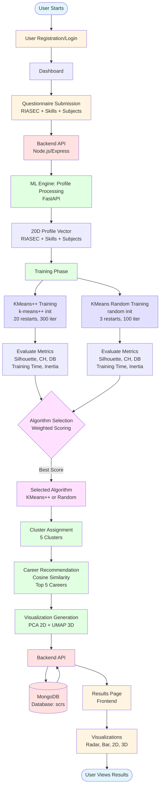
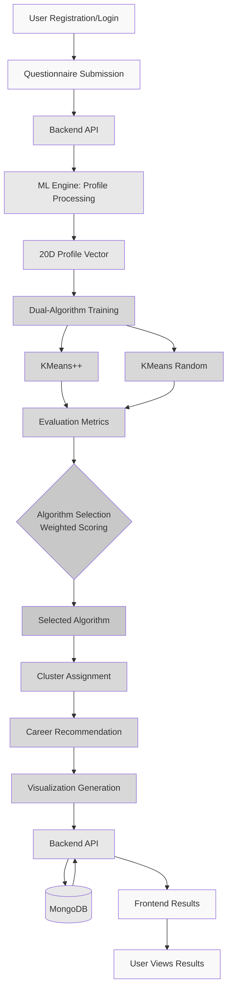

# Diagram Generation Guide for IEEE Report

## Figure 1: Total SCRS Workflow Diagram

This document provides instructions and prompts for generating the workflow diagram using AI tools.

**For ML Model Only Diagram**: See `docs/ML_MODEL_DIAGRAM.md`

---

## 📋 Diagram Requirements

The diagram should show:
1. **Data Flow**: User → Frontend → API → ML Engine → Database
2. **Dual-Algorithm Selection Process**: KMeans++ and KMeans (Random) training and selection
3. **Key Components**: Frontend, Backend API, ML Engine, MongoDB
4. **Process Steps**: Registration, Questionnaire, Clustering, Recommendation, Visualization

---

## 🤖 AI Generation Commands

### Option 1: Using ChatGPT/Claude with Mermaid

**Prompt:**
```
Create a Mermaid flowchart diagram showing the complete workflow of a Student Career Recommendation System (SCRS). The diagram should include:

1. User Registration/Login flow
2. Questionnaire submission (RIASEC, Skills, Subjects)
3. Profile processing in ML Engine
4. Dual-algorithm clustering system:
   - KMeans++ training
   - KMeans (Random) training
   - Automatic algorithm selection based on metrics
5. Cluster assignment
6. Career recommendation using cosine similarity
7. Visualization generation (PCA 2D, UMAP 3D)
8. Results display in frontend

Use professional IEEE-style formatting with clear labels. Show data flow with arrows. Include decision points for algorithm selection.
```

**Command to generate:**
```bash
# Save the Mermaid code to a file
# Then use online tools or VS Code extensions to render
```

### Option 2: Using DALL-E / Midjourney / Stable Diffusion

**Prompt:**
```
Create a professional technical diagram showing a complete workflow for a Student Career Recommendation System. The diagram should be in IEEE paper style:

- Black and white or minimal color scheme
- Clear boxes for: Frontend (React), Backend API (Node.js), ML Engine (Python), Database (MongoDB)
- Arrows showing data flow from user registration through questionnaire submission, profile processing, dual-algorithm clustering (KMeans++ and KMeans Random), algorithm selection, cluster assignment, career recommendation, and visualization
- Include labels for each step
- Professional, clean, academic style suitable for IEEE conference paper
- Landscape orientation
- High resolution suitable for publication
```

**Commands:**
```bash
# For DALL-E (OpenAI API)
# Use OpenAI Playground or API

# For Midjourney (Discord)
/imagine prompt: [paste the prompt above]

# For Stable Diffusion (local or online)
# Use tools like Automatic1111, ComfyUI, or online services
```

### Option 3: Using Online AI Diagram Tools

**Tools:**
- **Mermaid Live Editor**: https://mermaid.live/
- **Draw.io (diagrams.net)**: https://app.diagrams.net/
- **Lucidchart**: AI-assisted diagramming
- **Whimsical**: AI diagram generation

**Command for Mermaid:**
```bash
# Copy the Mermaid code below to mermaid.live
# Export as PNG/SVG for IEEE report
```

---

## 📊 Mermaid Code Template



---

## 🎨 Simplified Version (Black & White for IEEE)



---

## 🛠️ Step-by-Step Generation Process

### Method 1: Using Mermaid (Recommended for IEEE)

1. **Copy the Mermaid code above**

2. **Go to Mermaid Live Editor:**
   ```
   https://mermaid.live/
   ```

3. **Paste the code and customize**

4. **Export as PNG (high resolution):**
   - Click "Actions" → "Download PNG"
   - Use 300 DPI for IEEE publication

5. **Or export as SVG:**
   - Click "Actions" → "Download SVG"
   - Can be edited in Inkscape/Illustrator

### Method 2: Using AI Image Generation

1. **Use the prompt provided above**

2. **For DALL-E:**
   ```bash
   # Use OpenAI Playground or API
   # Set size to 1024x1024 or 1792x1024 (landscape)
   ```

3. **For Midjourney:**
   ```
   /imagine prompt: [paste the detailed prompt]
   --ar 16:9 --style raw --v 6
   ```

4. **Post-process:**
   - Convert to black & white if needed
   - Add text labels if AI didn't include them
   - Ensure high resolution (300 DPI minimum)

### Method 3: Using Draw.io with AI Assistance

1. **Open Draw.io:**
   ```
   https://app.diagrams.net/
   ```

2. **Use AI assistant (if available) or manually create:**
   - Drag components
   - Add arrows for flow
   - Use IEEE-style formatting

3. **Export:**
   - File → Export as → PNG (300 DPI)

---

## 📐 IEEE Formatting Requirements

- **Resolution**: Minimum 300 DPI
- **Format**: PNG, PDF, or EPS (vector preferred)
- **Color**: Black & white or grayscale (color acceptable if necessary)
- **Font**: Clear, readable (Arial, Times New Roman, or similar)
- **Size**: Fits within IEEE column width (3.5" single column or 7" double column)
- **Labels**: All components clearly labeled
- **Arrows**: Show direction of data flow

---

## ✅ Final Checklist

- [ ] Diagram shows complete workflow
- [ ] Dual-algorithm selection process is clear
- [ ] All components labeled
- [ ] Data flow arrows are clear
- [ ] High resolution (300 DPI minimum)
- [ ] Black & white or minimal color
- [ ] Professional appearance
- [ ] Fits IEEE formatting requirements

---

## 📝 Caption Text

```
Fig. 1. Total SCRS Workflow Diagram showing the complete data flow from user registration through questionnaire submission, profile processing, dual-algorithm clustering (KMeans++ and KMeans Random), automatic algorithm selection, cluster assignment, career recommendation, and visualization generation. The system architecture includes React frontend, Node.js/Express backend API, Python FastAPI ML engine, and MongoDB database.
```

---

**Recommended Tool**: Mermaid Live Editor (https://mermaid.live/)  
**Export Format**: PNG (300 DPI) or SVG  
**Style**: Professional, IEEE-compliant

