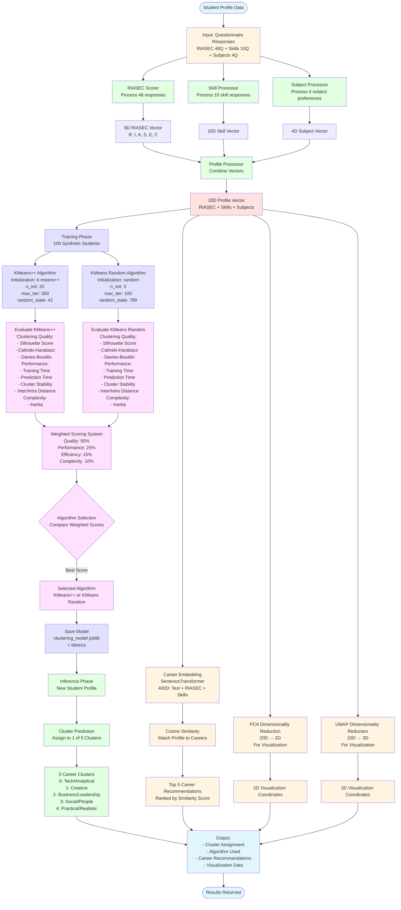
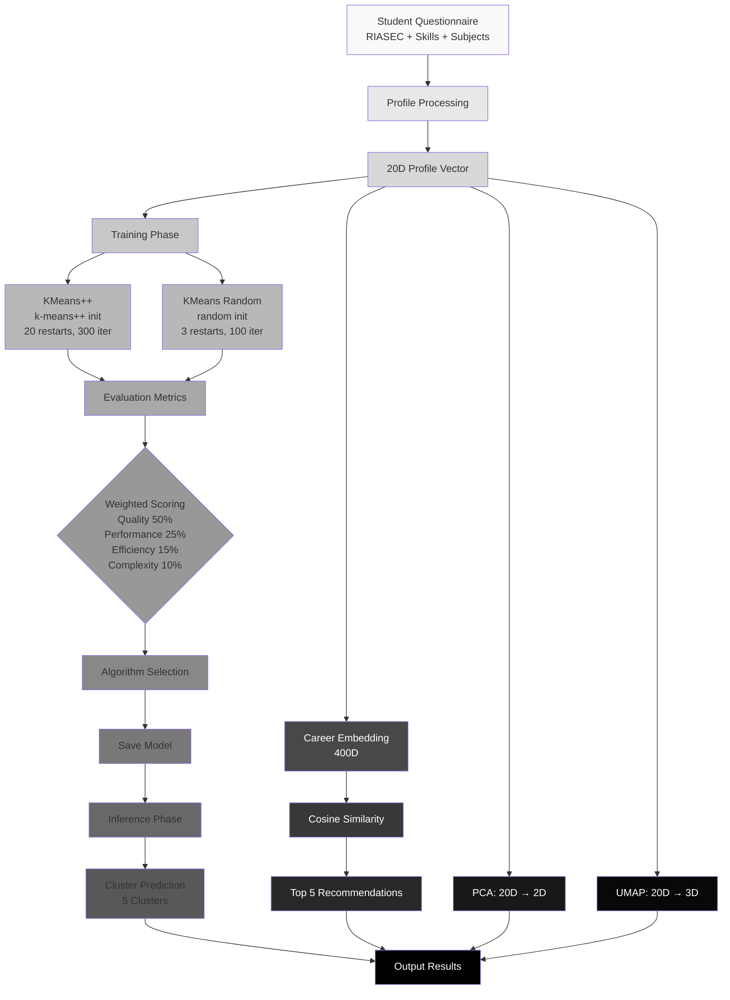
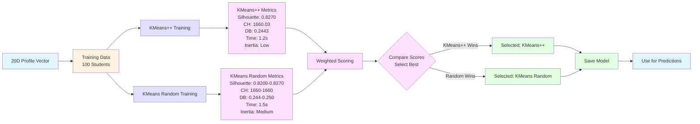

# ML Model Workflow Diagram - Mermaid Code

## Figure: ML Engine Workflow Diagram

This diagram shows the complete ML model workflow including dual-algorithm clustering and selection process.

---

## 🎨 Mermaid Code - ML Model Workflow



---

## 🎨 Simplified Version (Black & White for IEEE)



---

## 🎨 Focused Dual-Algorithm Selection Diagram



---

## 📋 How to Use

### Step 1: Open Mermaid Live Editor
```
https://mermaid.live/
```

### Step 2: Copy and Paste
Copy one of the Mermaid code blocks above and paste into the editor.

### Step 3: Customize
- Adjust colors for IEEE (black & white recommended)
- Modify labels if needed
- Resize elements

### Step 4: Export
- Click "Actions" → "Download PNG" (300 DPI)
- Or "Download SVG" for vector format

---

## 📐 IEEE Formatting Tips

1. **Use Simplified Version**: The black & white version is best for IEEE papers
2. **Resolution**: Export at 300 DPI minimum
3. **Size**: Ensure it fits within IEEE column width (3.5" single, 7" double)
4. **Labels**: All components should be clearly labeled
5. **Arrows**: Show clear direction of flow

---

## 📝 Caption Text

```
Fig. X. ML Engine Workflow Diagram showing the dual-algorithm clustering system. The workflow includes profile processing (RIASEC, Skills, Subjects → 20D vector), dual-algorithm training (KMeans++ and KMeans Random), comprehensive evaluation with weighted scoring, automatic algorithm selection, model persistence, and inference phase producing cluster assignments, career recommendations, and visualization coordinates.
```

---

## ✅ Recommended Diagram

For IEEE paper, use the **Simplified Version (Black & White)** as it:
- Is clean and professional
- Works well in grayscale/black & white
- Clearly shows the dual-algorithm process
- Fits IEEE formatting requirements

---

**Tool**: Mermaid Live Editor (https://mermaid.live/)  
**Export**: PNG (300 DPI) or SVG  
**Style**: Professional, IEEE-compliant

