# ML Model Internal Workflow Diagram

## How the ML Model Works - Internal Process

This diagram shows the internal workings of the ML model only, focusing on the data processing, training, and inference pipeline.

---

## 🎨 Mermaid Code - ML Model Internal Workflow

```mermaid
flowchart TD
    %% Input Processing
    Input[Input: Questionnaire Responses] --> RIASEC[RIASEC Scorer<br/>48 Questions → 6D Vector<br/>R, I, A, S, E, C]
    Input --> Skills[Skill Processor<br/>10 Questions → 10D Vector]
    Input --> Subjects[Subject Processor<br/>4 Questions → 4D Vector]
    
    RIASEC --> Combine[Vector Combination<br/>Concatenate Arrays]
    Skills --> Combine
    Subjects --> Combine
    
    Combine --> Profile[20D Profile Vector<br/>[RIASEC_6D, Skills_10D, Subjects_4D]]
    
    %% Training Phase
    Profile --> TrainData[Training Dataset<br/>100 Student Profiles<br/>Each: 20D Vector]
    
    TrainData --> Split[Split Training Data]
    
    Split --> TrainKMeansPP[Train KMeans++<br/>Algorithm]
    Split --> TrainKMeansRand[Train KMeans Random<br/>Algorithm]
    
    TrainKMeansPP --> KMeansPP[KMeans++ Model<br/>Parameters:<br/>- init: k-means++<br/>- n_init: 20<br/>- max_iter: 300<br/>- n_clusters: 5<br/>- random_state: 42]
    
    TrainKMeansRand --> KMeansRand[KMeans Random Model<br/>Parameters:<br/>- init: random<br/>- n_init: 3<br/>- max_iter: 100<br/>- n_clusters: 5<br/>- random_state: 789]
    
    %% Evaluation Phase
    KMeansPP --> EvalPP[Evaluate KMeans++<br/>Calculate Metrics]
    KMeansRand --> EvalRand[Evaluate KMeans Random<br/>Calculate Metrics]
    
    EvalPP --> MetricsPP[KMeans++ Metrics<br/>Quality:<br/>- Silhouette Score<br/>- Calinski-Harabasz<br/>- Davies-Bouldin<br/>Performance:<br/>- Training Time<br/>- Prediction Time<br/>- Cluster Stability<br/>- Inter/Intra Distance<br/>Complexity:<br/>- Inertia]
    
    EvalRand --> MetricsRand[KMeans Random Metrics<br/>Quality:<br/>- Silhouette Score<br/>- Calinski-Harabasz<br/>- Davies-Bouldin<br/>Performance:<br/>- Training Time<br/>- Prediction Time<br/>- Cluster Stability<br/>- Inter/Intra Distance<br/>Complexity:<br/>- Inertia]
    
    %% Selection Phase
    MetricsPP --> Scoring[Weighted Scoring<br/>Quality: 50%<br/>Performance: 25%<br/>Efficiency: 15%<br/>Complexity: 10%]
    MetricsRand --> Scoring
    
    Scoring --> Compare[Compare Scores<br/>Select Best Algorithm]
    
    Compare -->|Higher Score| SelectPP[Selected: KMeans++]
    Compare -->|Higher Score| SelectRand[Selected: KMeans Random]
    
    SelectPP --> SaveModel[Save Selected Model<br/>+ All Metrics<br/>clustering_model.joblib]
    SelectRand --> SaveModel
    
    %% Inference Phase
    SaveModel --> LoadModel[Load Model<br/>for Inference]
    
    NewProfile[New Student Profile<br/>20D Vector] --> LoadModel
    
    LoadModel --> Predict[Cluster Prediction<br/>Find Nearest Cluster Center<br/>Euclidean Distance]
    
    Predict --> ClusterID[Cluster Assignment<br/>0-4]
    
    ClusterID --> ClusterName[Cluster Name<br/>Tech/Analytical<br/>Creative<br/>Business/Leadership<br/>Social/People<br/>Practical/Realistic]
    
    %% Career Recommendation
    NewProfile --> CareerEmbed[Career Embedding<br/>SentenceTransformer<br/>400D per Career]
    
    CareerEmbed --> Similarity[Cosine Similarity<br/>Compare Profile vs Careers<br/>similarity = dot(v1, v2) / (||v1|| × ||v2||)]
    
    Similarity --> Rank[Rank Careers<br/>Sort by Similarity Score]
    
    Rank --> Top5[Top 5 Recommendations<br/>Highest Similarity]
    
    %% Visualization
    NewProfile --> PCA[PCA Reduction<br/>20D → 2D<br/>Principal Components]
    
    NewProfile --> UMAP[UMAP Reduction<br/>20D → 3D<br/>Manifold Learning]
    
    PCA --> Coords2D[2D Coordinates<br/>[x, y]]
    UMAP --> Coords3D[3D Coordinates<br/>[x, y, z]]
    
    %% Output
    ClusterName --> Output[Model Output]
    Top5 --> Output
    Coords2D --> Output
    Coords3D --> Output
    
    Output --> Result[Results:<br/>- Cluster Assignment<br/>- Algorithm Used<br/>- Top 5 Careers<br/>- 2D/3D Coordinates]
    
    style Input fill:#e1f5ff
    style RIASEC fill:#e1ffe1
    style Skills fill:#e1ffe1
    style Subjects fill:#e1ffe1
    style Combine fill:#e1ffe1
    style Profile fill:#ffe1e1
    style TrainData fill:#fff4e1
    style TrainKMeansPP fill:#e1e1ff
    style TrainKMeansRand fill:#e1e1ff
    style KMeansPP fill:#e1e1ff
    style KMeansRand fill:#e1e1ff
    style EvalPP fill:#ffe1ff
    style EvalRand fill:#ffe1ff
    style MetricsPP fill:#ffe1ff
    style MetricsRand fill:#ffe1ff
    style Scoring fill:#ffe1ff
    style Compare fill:#ffe1ff
    style SelectPP fill:#e1ffe1
    style SelectRand fill:#e1ffe1
    style SaveModel fill:#e1e1ff
    style LoadModel fill:#e1ffe1
    style NewProfile fill:#e1f5ff
    style Predict fill:#e1ffe1
    style ClusterID fill:#e1ffe1
    style ClusterName fill:#e1ffe1
    style CareerEmbed fill:#fff4e1
    style Similarity fill:#fff4e1
    style Rank fill:#fff4e1
    style Top5 fill:#fff4e1
    style PCA fill:#fff4e1
    style UMAP fill:#fff4e1
    style Coords2D fill:#fff4e1
    style Coords3D fill:#fff4e1
    style Output fill:#e1f5ff
    style Result fill:#e1f5ff
```

---

## 🎨 Simplified Version (Black & White for IEEE)

```mermaid
flowchart TD
    A[Questionnaire Input<br/>RIASEC + Skills + Subjects] --> B[Process Inputs]
    B --> C[20D Profile Vector]
    
    C --> D[Training Phase<br/>100 Student Profiles]
    
    D --> E[Train KMeans++<br/>k-means++ init<br/>20 restarts, 300 iter]
    D --> F[Train KMeans Random<br/>random init<br/>3 restarts, 100 iter]
    
    E --> G[Calculate Metrics<br/>Quality + Performance<br/>+ Efficiency + Complexity]
    F --> G
    
    G --> H[Weighted Scoring<br/>Compare Algorithms]
    
    H --> I[Select Best Algorithm]
    I --> J[Save Model]
    
    J --> K[Inference Phase]
    
    L[New Student Profile<br/>20D Vector] --> K
    
    K --> M[Predict Cluster<br/>Find Nearest Center]
    M --> N[Assign to Cluster 0-4]
    
    L --> O[Career Embedding<br/>400D per Career]
    O --> P[Cosine Similarity]
    P --> Q[Top 5 Careers]
    
    L --> R[PCA: 20D → 2D]
    L --> S[UMAP: 20D → 3D]
    
    N --> T[Output Results]
    Q --> T
    R --> T
    S --> T
    
    style A fill:#f9f9f9
    style B fill:#e8e8e8
    style C fill:#d8d8d8
    style D fill:#c8c8c8
    style E fill:#b8b8b8
    style F fill:#b8b8b8
    style G fill:#a8a8a8
    style H fill:#989898
    style I fill:#888888
    style J fill:#787878
    style K fill:#686868
    style L fill:#f9f9f9
    style M fill:#585858
    style N fill:#484848,color:#fff
    style O fill:#383838,color:#fff
    style P fill:#282828,color:#fff
    style Q fill:#181818,color:#fff
    style R fill:#080808,color:#fff
    style S fill:#000000,color:#fff
    style T fill:#000000,color:#fff
```



---

## 🎨 Focused Training & Selection Diagram


---

## 🎨 Inference-Only Diagram (How Model Makes Predictions)

```mermaid
flowchart TD
    Input[New Student Profile<br/>20D Vector] --> Load[Load Trained Model<br/>clustering_model.joblib]
    
    Load --> Model[Selected Algorithm<br/>KMeans++ or KMeans Random]
    
    Model --> Centers[5 Cluster Centers<br/>Each: 20D Vector]
    
    Input --> Distance[Calculate Distances<br/>Euclidean Distance<br/>from Input to Each Center]
    Centers --> Distance
    
    Distance --> Min[Find Minimum Distance<br/>Nearest Cluster Center]
    
    Min --> Assign[Assign to Cluster<br/>Cluster ID: 0-4]
    
    Assign --> Name[Map to Cluster Name<br/>0: Tech/Analytical<br/>1: Creative<br/>2: Business/Leadership<br/>3: Social/People<br/>4: Practical/Realistic]
    
    Input --> Career[Career Embeddings<br/>25 Careers × 400D]
    
    Career --> Extract[Extract 20D from<br/>Career Embeddings<br/>RIASEC + Skills]
    
    Input --> Sim[Cosine Similarity<br/>Profile vs Each Career<br/>similarity = cos(θ)]
    Extract --> Sim
    
    Sim --> Sort[Sort by Similarity<br/>Descending Order]
    
    Sort --> Top[Select Top 5<br/>Highest Similarity]
    
    Input --> PCA[PCA Transform<br/>20D → 2D]
    Input --> UMAP[UMAP Transform<br/>20D → 3D]
    
    Name --> Output[Output]
    Top --> Output
    PCA --> Output
    UMAP --> Output
    
    style Input fill:#e1f5ff
    style Load fill:#e1ffe1
    style Model fill:#e1ffe1
    style Centers fill:#ffe1ff
    style Distance fill:#e1ffe1
    style Min fill:#e1ffe1
    style Assign fill:#e1ffe1
    style Name fill:#e1ffe1
    style Career fill:#fff4e1
    style Extract fill:#fff4e1
    style Sim fill:#fff4e1
    style Sort fill:#fff4e1
    style Top fill:#fff4e1
    style PCA fill:#fff4e1
    style UMAP fill:#fff4e1
    style Output fill:#e1f5ff
```

---

## 📋 How to Use

### Step 1: Open Mermaid Live Editor
```
https://mermaid.live/
```

### Step 2: Choose Your Diagram
- **Full Detailed**: Complete ML workflow with all components
- **Simplified (Recommended)**: Clean black & white for IEEE papers
- **Training & Selection**: Focus on dual-algorithm selection
- **Inference Only**: How the model makes predictions

### Step 3: Copy and Paste
Copy the Mermaid code and paste into the editor.

### Step 4: Export
- Click "Actions" → "Download PNG" (300 DPI)
- Or "Download SVG" for vector format

---

## 📐 IEEE Formatting

For IEEE papers, use the **Simplified Version (Black & White)**:
- Clean and professional
- Works in grayscale
- Clearly shows ML model workflow
- Fits IEEE formatting requirements

---

## 📝 Caption Text

```
Fig. X. ML Model Internal Workflow showing the complete machine learning pipeline: (1) Input processing from questionnaire responses to 20D profile vector, (2) Dual-algorithm training phase with KMeans++ and KMeans Random, (3) Comprehensive evaluation and weighted scoring for algorithm selection, (4) Model persistence, (5) Inference phase for cluster prediction, career recommendation via cosine similarity, and dimensionality reduction for visualization.
```

---

## ✅ Key Components Shown

1. **Input Processing**: Questionnaire → 20D Vector
2. **Training**: Dual-algorithm training with different initializations
3. **Evaluation**: Comprehensive metrics calculation
4. **Selection**: Weighted scoring and algorithm selection
5. **Inference**: Cluster prediction, career matching, visualization

---

**Tool**: Mermaid Live Editor (https://mermaid.live/)  
**Export**: PNG (300 DPI) or SVG  
**Style**: Professional, IEEE-compliant

